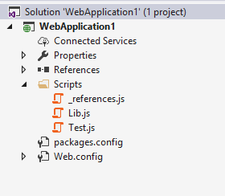
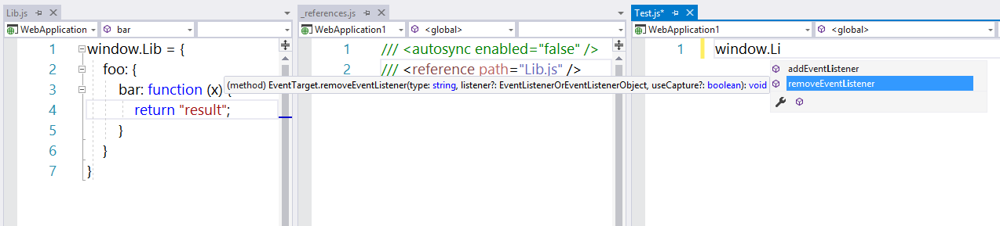
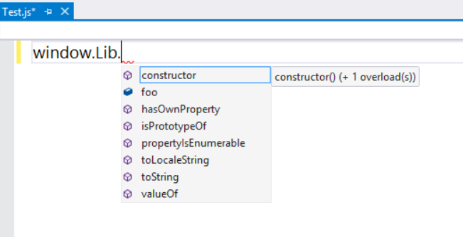

# For VS2017, Both new/old JavaScript language service doesn't support _references file

It still doesn't show correct JavaScript intellisense based on `_references.js` file. This can be reproduce for both new/old JavaScript language service.

In VS2017:

In VS2015:

